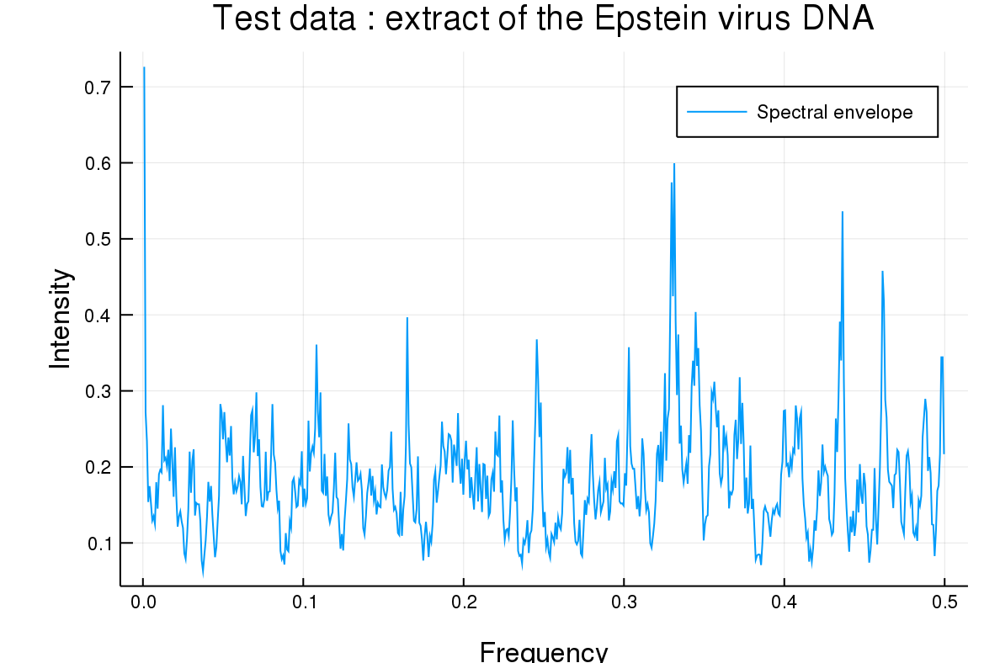

**Travis**
:-------:
[


# Spectral Envelope
A fast and easy to use julia implementation of the spectral envelope method, used in categorical data analysis.

The spectral envelope is a tool to study cyclic behaviors in categorical data in a more efficient way the traditional approach.

Usually the method used to study categorical data is to attribute a number to each category in order to carry the analysis on, by estimating the power-spectral density for instance.<br/>
The spectral envelope finds, for each frequency in the data, the real-numbered mapping that maximizes the power-spectral density at this point. Hence the name: no matter what real-numbered mapping one chooses, the power-spectral density obtained will always be smaller of equal the spectral envelope.

### Installation and import :
```Julia
# installing the module
Using Pkg
Pkg.clone(“https://github.com/johncwok/SpectralEnvelope.jl.git”)
# importing the module
Using SpectralEnvelope
```
## Usage :
```spectral_envelope 
Input
  -ts : array containing the time series to be analysed.
  -m : the smoothing parameter. It’s value corresponds to how many neighboring points 
      are to be taken in account in the smoothing. Defaults to 3.
Returns 
  -freq : An array containing the frequency of the power-spectrum (or spectral envelope)
  -se : the value of the spectral envelope for each frequency value.
  -eigvec : Array containing the optimal real-valued mapping for each frequency.
  -categories : the categories which are present in the data.
```
To use the spectral envelope, call the function ```spectral_envelope```, you can them plot the results and extract the mapping for a given frequency.
```Julia
x,y,e = spectral_envelope(data; m = 4)
#plotting the results
Using Plots
plot(x,y)
```

 
To get the mappings, you can use the ```get_mapping()``` function, providing it with the frequencies, the spectral envelope and the desired position (you can also use spalting) :
```Julia
x,y,e,c =spectral_envelope(data; m =0)
get_mapping(goal,x,y,e,c)
# using spalting : get_mapping(goal,spectral_envelope(data;m=0)…)
>> position of peak: 0.3338  strength of peak: 0.8067 
 ["A : -0.3959646304003992", "G : -0.3930054480816879", "T : 0.8282155690720968", "C : 0.1326439759143416"]
```
The function automatically prints the positions and intensity of the peak so that you may control that you actually gave the frequency you want to study.
In this example, we see that when looking at the frequency 0.33, the codons A and G have an equivalent and have therefore, a the same mapping.

### Remark :
The spectral envelope method was defined by David S. Stoffer in *DAVID S. STOFFER, DAVID E. TYLER, ANDREW J. MCDOUGALL, Spectral analysis for categorical time series: Scaling and the spectral envelope*.\
He also provided an R implementation in his book *Time series analysis and its applications*, however, its is not very user-friendly and extracting the optimal mappings with it is really not straightforward.
